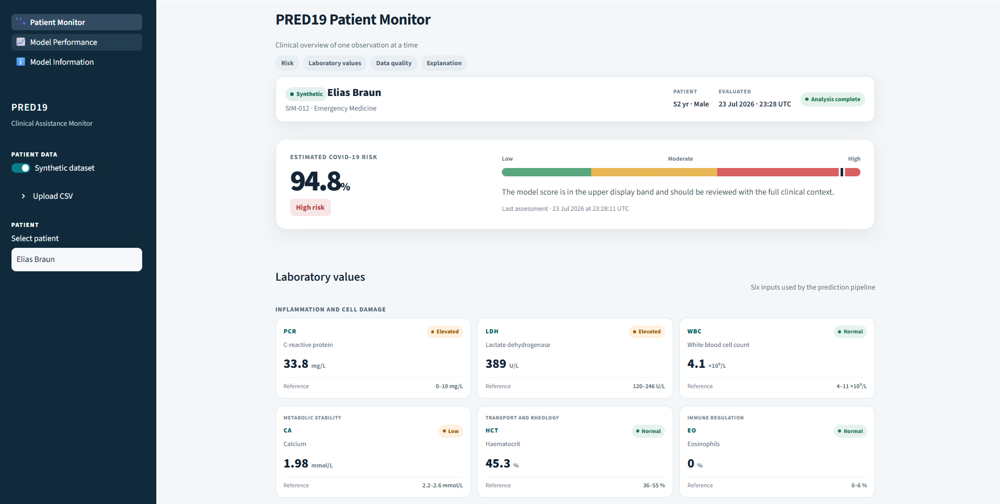

# PRED19 — COVID-19 Risk Estimation from Laboratory Data

[](https://pred19.streamlit.app/)

## Overview

PRED19 is a machine-learning-based clinical decision-support prototype designed to estimate COVID-19 risk from routinely collected laboratory observations. It validates six laboratory inputs, transforms them with the fitted preprocessing pipeline, and returns the XGBoost model's estimated probability for the positive class.

PRED19 was developed using real-world laboratory data collected in German hospitals. The synthetic patient records included in the interactive demo are used exclusively for demonstration and do not replace or alter the original clinical data used for model development and evaluation.

This is an academic prototype. Its output is a model score, not a diagnosis, and it must not be used as a substitute for professional medical evaluation.



*Patient Monitor using a fully synthetic demonstration record. The displayed prediction is not evidence of population-level performance.*

## Problem statement

Laboratory observations contain patterns that may help distinguish positive and negative COVID-19 cases. The original analysis in [`medas.ipynb`](medas.ipynb) investigates whether a small set of routinely recorded variables can support binary classification while remaining suitable for a compact decision-support workflow.

The project addresses three technical tasks:

- preparing incomplete and heterogeneous laboratory data;
- training and evaluating a binary probabilistic classifier;
- presenting the resulting probability and its input context in an accessible form.

It does not establish clinical causality, confirm infection, or recommend treatment.

## Solution overview

The complete system follows this sequence:

```text
Laboratory observations
        ↓
Schema and numeric-value validation
        ↓
Notebook-compatible cleaning and missing-value handling
        ↓
Selection of PCR, LDH, WBC, CA, HCT, and EO
        ↓
RobustScaler transformation
        ↓
Trained XGBoost classifier
        ↓
Positive-class probability and thresholded prediction
        ↓
Optional clinical-style presentation and interpretation
```

The interactive interface is the final presentation layer. The Python package separates data preparation, model development, runtime inference, and presentation under `pred19/`; trained and evaluated outputs remain under `model/` and `artifacts/`.

## Dataset

The model-development dataset contains real hospital laboratory observations originating from Germany. The repository and notebook do not identify the contributing hospitals or institutions. They also do not document the collection period, formal study-population definition, inclusion or exclusion criteria, ethical approval, or data-sharing conditions. No more specific provenance claim is therefore made.

The source CSV is treated as private and is excluded from Git. The notebook and cleaning report document the following structure:

| Dataset stage | Observations | Notes |
|---|---:|---|
| Original source | 1,736 | Described in the notebook as 36 columns before cleaning |
| After exact-duplicate removal | 1,727 | Nine duplicated rows removed |
| Negative target (`0`) | 912 | 52.81% of the cleaned dataset |
| Positive target (`1`) | 815 | 47.19% of the cleaned dataset |
| Training partition | 1,381 | Stratified 80% partition |
| Test partition | 346 | Stratified 20% holdout |

The public interactive demo is different from the model-development dataset. [`inference/demo_synthetic.csv`](inference/demo_synthetic.csv) contains 12 fully synthetic patient records created only to exercise the interface. These records do not represent real patients and are not used to train, tune, or evaluate the model.

## Model inputs

The exported model receives exactly six variables, in this order:

| Clinical group | Code | Variable | Role in this project |
|---|---|---|---|
| Inflammation and cell damage | `PCR` | C-reactive protein (CRP) | Inflammatory marker evaluated as a predictor |
| Inflammation and cell damage | `LDH` | Lactate dehydrogenase | Marker associated with cellular or tissue damage |
| Inflammation and cell damage | `WBC` | White blood cell count | Haematological measure of circulating white cells |
| Metabolic stability | `CA` | Calcium | Metabolic laboratory measurement |
| Transport and rheology | `HCT` | Haematocrit | Proportion of blood volume occupied by red cells |
| Immune regulation | `EO` | Eosinophils | Component of the white-cell differential |

These descriptions provide clinical context; they do not imply that any variable causes the prediction or the target outcome. The notebook selected the six features after exploratory distribution, correlation, and mutual-information analyses. It does not document the measurement units. Units and reference intervals shown by the demonstration interface are presentation configuration and are not inputs to the model.

## Data preparation

[`pred19/data/preparation.py`](pred19/data/preparation.py) reproduces the cleaning order used in the notebook:

1. Load `data/data.csv`.
2. Remove `Suspect` and `Unnamed: 0`.
3. Convert decimal commas to decimal points and coerce the laboratory columns to numeric values.
4. Validate the binary `target` column.
5. Remove nine exact duplicate rows.
6. Remove `CK` and `UREA` because of their high missing-value rates.
7. Impute `ALP`, `GGT`, `BA`, `NET`, `LYT`, `MOT`, `NE`, `LY`, `BAT`, `EOT`, `MO`, and `EO` with a five-neighbour `KNNImputer`.
8. Impute the notebook's remaining numeric variables with their means, including `PCR`, `LDH`, `WBC`, `CA`, and `HCT`.
9. Impute `Sex` with its mode.
10. Export the cleaned training data, the six-column inference input, and a cleaning report.

The cleaning report records the missing values in the six final inputs before imputation:

| Variable | Missing observations |
|---|---:|
| `PCR` | 88 |
| `LDH` | 294 |
| `WBC` | 54 |
| `CA` | 84 |
| `HCT` | 54 |
| `EO` | 353 |

All six columns are complete after the notebook-compatible imputation.

Important: the original notebook performs imputation on the complete cleaned dataset before the train/test split. The reproduction script preserves that order for comparability, but this introduces information leakage from the future test partition and is a methodological limitation.

## Model development

The model-development workflow is implemented in [`pred19/modeling/training.py`](pred19/modeling/training.py):

- **Split:** stratified 80/20 train/test split with `random_state=42`.
- **Preprocessing:** `RobustScaler` inside a `ColumnTransformer`.
- **Baseline:** logistic regression in the original notebook.
- **Final model:** `XGBClassifier`.
- **Hyperparameter selection:** five-fold `GridSearchCV`, scored by ROC-AUC.
- **Search grid:** 100/200 estimators, depths 3/5/7, learning rates 0.01/0.05/0.1, and subsampling 0.8/1.0.
- **Best notebook configuration:** learning rate 0.05, depth 3, 100 estimators, and subsampling 0.8.
- **Export:** fitted scaler/model pipeline stored with Joblib.

The exported pipeline generates the positive-class probability with `predict_proba`. A probability of at least `0.4` produces the positive binary prediction. The notebook evaluates this threshold on the test partition; it was not selected or validated on an independent cohort.

The presentation layer also displays three visual score bands:

| Demo band | Probability |
|---|---:|
| Low | `< 0.25` |
| Moderate | `0.25–<0.60` |
| High | `≥ 0.60` |

These bands are interface conventions only. They are separate from the model's `0.4` binary decision threshold and are not clinically validated categories.

## Evaluation methodology

Model selection uses five-fold cross-validation on the training partition. Final performance is calculated once on the 346-observation holdout partition. The repository includes:

- machine-readable metrics in [`artifacts/model_metrics.json`](artifacts/model_metrics.json);
- false-positive-rate, true-positive-rate, and threshold coordinates in [`artifacts/roc_curve.csv`](artifacts/roc_curve.csv);
- the original notebook's classification reports, ROC analysis, confusion matrices, and global SHAP analyses.

SHAP plots in the notebook describe global model behaviour. The exported application does not calculate patient-level SHAP values and does not claim that an individual laboratory value caused a prediction.

## Results

### Exported model artifact

The current artifact was reproduced with the pinned dependency versions in `requirements.txt`.

| Metric | Holdout result |
|---|---:|
| Five-fold training CV ROC-AUC | 0.8922 |
| Test ROC-AUC | 0.8559 |
| Accuracy | 78.32% |
| Sensitivity / positive-class recall | 85.28% |
| Specificity | 72.13% |
| Positive-class precision | 73.16% |
| Negative predictive value | 84.62% |
| F1-score | 0.7875 |
| Decision threshold | 0.4 |
| Test observations | 346 |

Confusion matrix at the `0.4` threshold:

| | Predicted negative | Predicted positive |
|---|---:|---:|
| Actual negative | 132 TN | 51 FP |
| Actual positive | 24 FN | 139 TP |

### Results recorded in the original notebook

| Result | Value |
|---|---:|
| Logistic regression test ROC-AUC | 0.8376 |
| Best XGBoost cross-validation ROC-AUC | 0.8919 |
| XGBoost test ROC-AUC | 0.8539 |
| XGBoost accuracy at threshold 0.4 | 79.19% |
| Positive-class precision at threshold 0.4 | 0.75 |
| Positive-class recall at threshold 0.4 | 0.85 |
| Positive-class F1-score at threshold 0.4 | 0.79 |

The small differences between the notebook and the exported artifact are reported rather than hidden. The notebook does not record exact library versions, while the reproduction uses pinned current versions.

Population-level evaluation metrics must not be confused with a prediction for one selected demo record.

## System architecture

| Layer | Responsibility | Main files |
|---|---|---|
| Data layer | Private clinical CSV and separate synthetic demo records | `data/`, `inference/demo_synthetic.csv` |
| Preparation layer | Cleaning, duplicate removal, numeric conversion, imputation, export | `pred19/data/preparation.py` |
| Model-development layer | Split, scaling, grid search, evaluation, model export | `pred19/modeling/training.py` |
| Inference layer | Model loading and positive-class probability generation | `pred19/inference/model.py`, `pred19/inference/prediction.py` |
| Validation layer | CSV parsing, schema checks, malformed-value rejection | `pred19/inference/csv_loader.py`, `pred19/inference/validation.py` |
| Artifact layer | Fitted pipeline, metrics, and ROC coordinates | `model/`, `artifacts/` |
| Presentation layer | Optional interactive review of observations and outputs | `app.py`, `pred19/ui/` |

Streamlit is used only in the presentation layer. It is not part of model training or evaluation.

## Repository structure

```text
medas.ipynb                    Original exploratory analysis and model comparison
pyproject.toml                 Package metadata, dependencies, and CLI entry points
pred19/
├── features.py                Canonical model-input definitions
├── settings.py                Project paths and runtime settings
├── data/
│   └── preparation.py         Notebook-compatible data preparation
├── modeling/
│   └── training.py            Training, tuning, evaluation, and export
├── inference/                 Validation, artifact loading, and prediction
└── ui/
    ├── components/            Reusable presentation components and styles
    └── pages/                 Streamlit page modules
model/pred19_pipeline.joblib   Exported RobustScaler/XGBoost pipeline
artifacts/model_metrics.json   Holdout metrics and training metadata
artifacts/roc_curve.csv        ROC curve coordinates
app.py                         Optional Streamlit presentation entry point
inference/demo_synthetic.csv   Fully synthetic public demo records
images/monitor.png             Demonstration screenshot
tests/                         Synthetic unit and application tests
```

The real clinical source file and derived private CSVs remain under the Git-ignored `data/` directory.

## Interactive demo

**Live demo:** [pred19.streamlit.app](https://pred19.streamlit.app/)

The Streamlit application is an optional presentation layer for exploring synthetic patient
observations, reviewing the six model inputs, and displaying model outputs. It does not replace the
model-development workflow or represent a clinical deployment.

## Acknowledgements

The original notebook was developed as part of **Project MeDaS — Detection of COVID-19 Using Machine Learning Methods** for the *Medical Data Science* course, taught by Prof. Dr. Christina Bartenschlager at Technische Hochschule Nürnberg Georg Simon Ohm.
